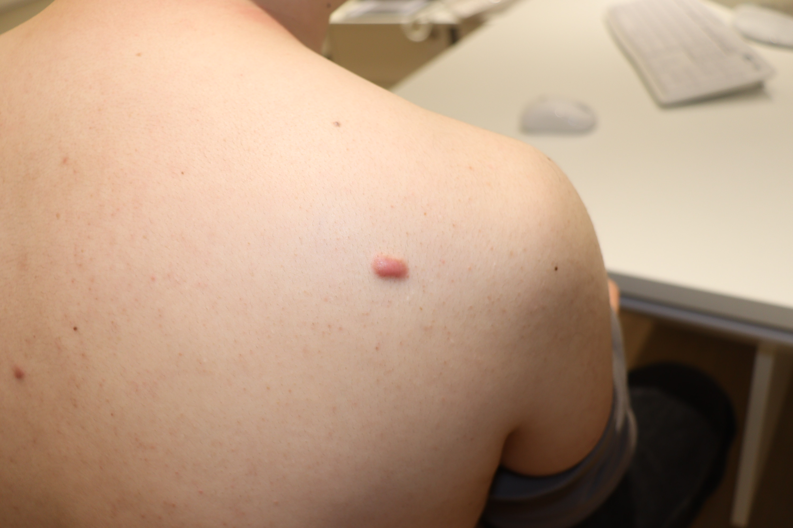
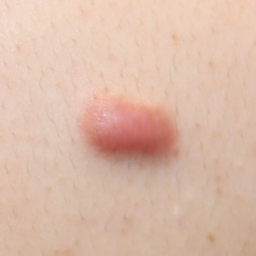
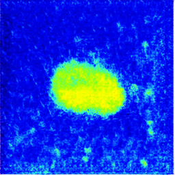
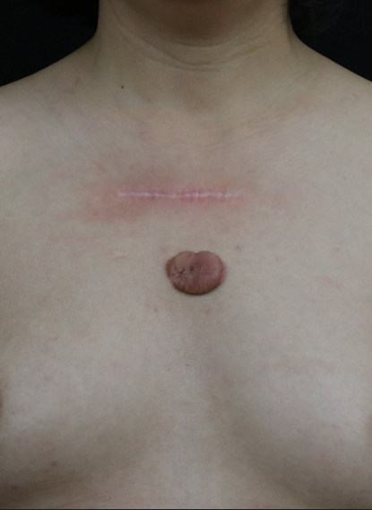
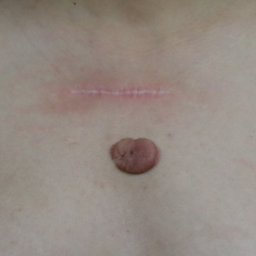
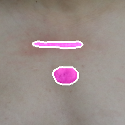
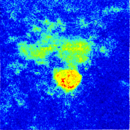

# SPT-Segmentation-Perfusion-Prediction-Treatment-Recommendation-for-Pathological-Scars

Development and Validation of an Artificial Intelligence-Assisted Clinical Decision and Follow-up Support System for Pathological Scars: A Prospective Multicenter Study.

We introduce a unified AI framework that links visual phenotyping with perfusion inference and clinical decision modeling. This goes beyond application-driven system development and represents a methodological advance with generalizable relevance for image-based biomedical analysis.

This repository contains the inference code for the SPT framework. Given a clinical pathological-scar photograph, the pipeline automatically segments and crops the lesion, predicts a blood perfusion image, and classifies the case as conservative or aggressive treatment using a Transformer fusion model.

## Pipeline

Run the full workflow:

```powershell
python .\keloid_treatment_classification_pipeline.py
```

Equivalent manual commands:

```powershell
python .\lesion_segmentation_and_cropping.py
python .\blood_perfusion_prediction.py --dataroot ./data/perfusion_pair_input --name blood_perfusion --model perfusion_gan
python .\transformer_treatment_classification.py
python .\clinical_report_generation.py
```

The stages are:

1. Segment the clinical photograph and crop the keloid lesion region.
2. Predict a blood perfusion image from the cropped lesion image.
3. Classify conservative/aggressive treatment using the cropped lesion image and predicted blood perfusion image.
4. Generate an HTML report for each case.

## Environment

Install dependencies:

```powershell
pip install -r requirements.txt
```

Install the `torch` and `torchvision` builds that match your CUDA version if the default wheels are not appropriate for your machine.

## Required Files

Expected input and checkpoint locations:

```text
data/raw_data/                         input clinical photographs
weights/segmentation/                  segmentation weights
weights/blood_perfusion/               blood perfusion generator checkpoint
weights/treatment_classification/      Transformer treatment classifier weights
```

Download the required model weights from
[Google Drive](https://drive.google.com/drive/folders/14ghEXUAYcL1M4Q6Q0kFLfFTIwK-PbYfI?usp=drive_link),
then place the downloaded files under the corresponding `weights/`
subdirectories shown above.

The repository includes two example test photographs:

```text
data/raw_data/case1.png
data/raw_data/case3.png
```

## Example Result

The example cases below illustrate the SPT inference workflow from the input
clinical photograph to lesion cropping, segmentation overlay, and predicted
blood perfusion.

<table>
  <tr>
    <th>Case</th>
    <th>Clinical photograph</th>
    <th>Cropped lesion</th>
    <th>Segmentation overlay</th>
    <th>Predicted blood perfusion</th>
  </tr>
  <tr>
    <td>case1.png</td>
    <td></td>
    <td></td>
    <td></td>
    <td></td>
  </tr>
  <tr>
    <td>case3.png</td>
    <td></td>
    <td></td>
    <td></td>
    <td></td>
  </tr>
</table>

Example predictions:

```text
Case: case1.png
Recommended treatment class: Conservative
Conservative probability: 0.999363
Aggressive probability: 0.000637

Case: case3.png
Recommended treatment class: Aggressive
Conservative probability: 0.000663
Aggressive probability: 0.999337
```

Important default checkpoint files:

```text
weights/segmentation/encoder_epoch_50.pth
weights/segmentation/decoder_epoch_50.pth
weights/blood_perfusion/latest_net_G.pth
weights/treatment_classification/both4cls_model1.pth
weights/treatment_classification/both4cls_model2.pth
weights/treatment_classification/both4cls_model3.pth
```

## Outputs

```text
data/crop_result/             cropped lesion images
data/seg_result/              segmentation masks
data/fuse_result/             mask overlays
data/perfusion_pair_input/test/    blood perfusion model inputs
data/perfusion_result/        predicted blood perfusion images
output_prediction.xlsx        treatment classification probabilities
reports/index.html            report index
reports/cases/                per-case HTML reports
```

## Data and Privacy

Clinical images, private spreadsheets, generated outputs, TensorBoard logs, NumPy arrays, and model weights are ignored by `.gitignore` by default. Review all files before sharing the repository.

For public release, provide anonymized sample data or controlled-access instructions rather than identifiable clinical files.
